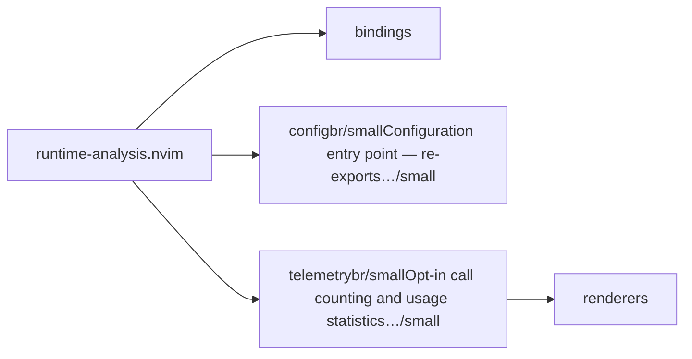
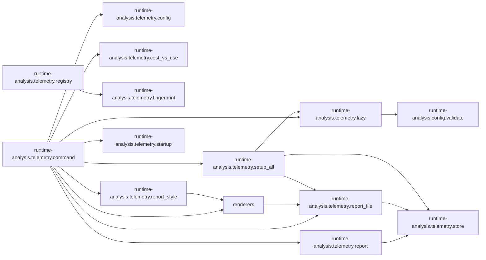

# runtime-analysis.nvim — module map

> **Generated** by `documentation`. Do not edit by hand — run `:DocMap`
> (or `nvim --headless -l scripts/gen_map.lua`) to regenerate.

**3 modules** · 2 namespaces · 35 helper files

The [interactive map](index.html) has filtering, full descriptions and
source links; this page is the version the code host renders directly.

## Namespaces

## Dependencies

Which parts of the tree require which, rolled up to the second level.
The [interactive map](index.html)'s **Deps** view has this per module,
in both directions, with load-time and lazy requires told apart.

## Modules

| Module | Description | Fns | Docs |
|---|---|---|---|
| `bindings` |  |  |  |
| `runtime-analysis.config` | Configuration entry point — re-exports the defaults in [`DEFAULTS.lua`](../../lua/runtime-analysis/config/DEFAULTS.lua). |  | [src](../../lua/runtime-analysis/config/init.lua) |
| `runtime-analysis.telemetry` | Opt-in call counting and usage statistics for any Lua/Neovim plugin that points an instance at its own modules. | 28 | [README](../../lua/runtime-analysis/telemetry/README.md) · [src](../../lua/runtime-analysis/telemetry/init.lua) |
| &nbsp;&nbsp;`renderers` |  |  |  |

## Drift

0 errors · 0 warnings · 4 info

No errors or warnings.

4 informational findings

| Check | Message |
|---|---|
| `missing-readme` | lua/runtime-analysis has no README.md |
| `missing-readme` | lua/runtime-analysis/config has no README.md |
| `unreferenced-module` | runtime-analysis.bench is required by no other file in the tree |
| `unreferenced-module` | runtime-analysis.health is required by no other file in the tree |

